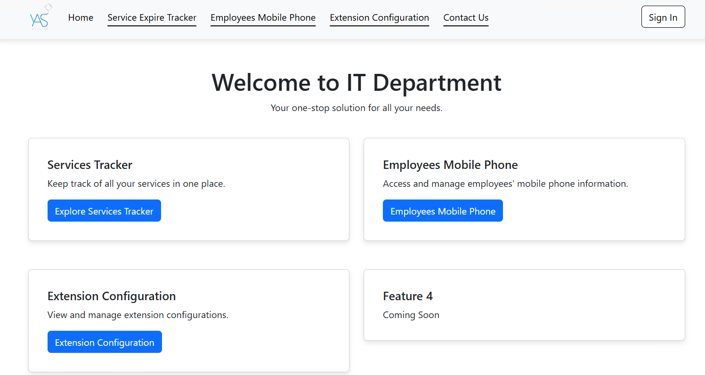
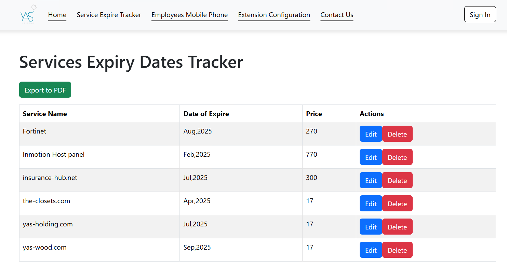
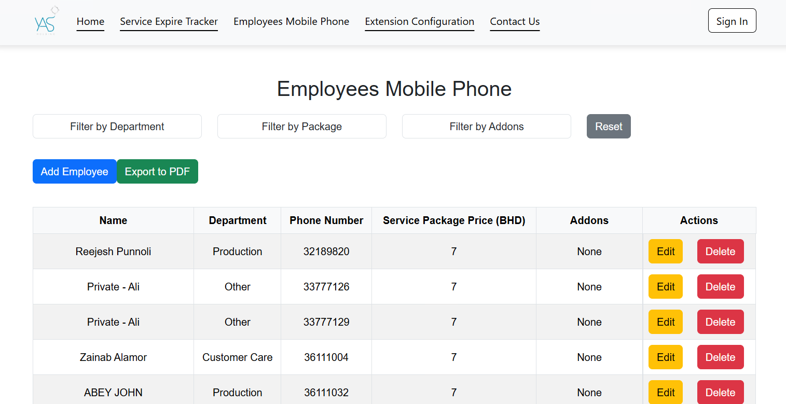
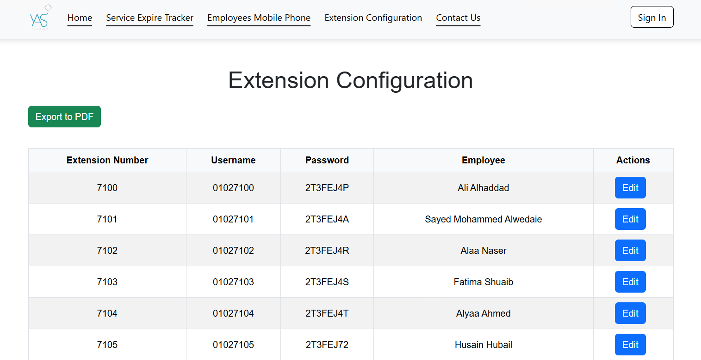
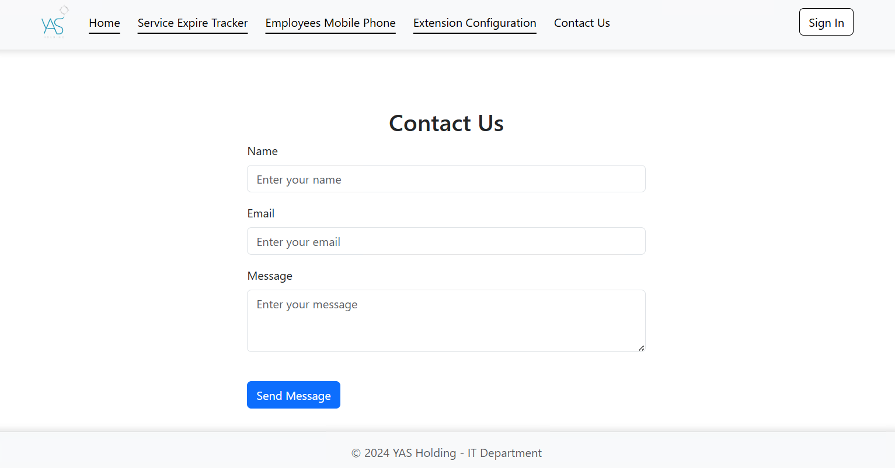

# ServiceSync Manager

ServiceSync Manager is a robust management system designed to streamline and optimize the way you handle various administrative tasks within an organization. This comprehensive toolset encompasses three main modules:

## Features

### 1. Extension Configuration
- **Manage Extensions**: Easily manage and configure extensions for your organization.
- **View and Edit**: View, edit, and update extension details including extension number, username, password, and assigned employee.
- **Export to PDF**: Export extension configurations to a PDF file for easy sharing and record-keeping.
- 
### 2. Employees Mobile Phone Management
- **Organize Database**: Maintain an organized database of employees' mobile phone information.
- **Sort and Filter**: Sort and filter employee details by department, service package, or add-ons.
- **Manage Records**: Add, edit, and delete employee records as needed.
- **Export to PDF**: Export employee data to a PDF file for quick access and distribution.

### 3. Service Expiry Dates Tracker
- **Track Expiry Dates**: Track the expiry dates of various services within your organization.
- **Manage Services**: Add new services and update existing service details including service name, expiry date, and price.
- **Export to PDF**: Export the list of services to a PDF file for monitoring and reporting purposes.

## Key Tools and Technologies

ManageTrack Pro leverages several modern web technologies and tools to provide a seamless and efficient user experience:

- **React**: A popular JavaScript library for building user interfaces. Used for creating dynamic, responsive, and interactive UI components.
- **React Bootstrap**: A UI framework that integrates Bootstrap components into React. Provides pre-styled, responsive components such as tables, forms, modals, and buttons, which enhance the user experience.
- **Axios**: A promise-based HTTP client for making requests to the server. Facilitates data fetching, updating, and deleting operations through API endpoints.
- **Express.js**: A fast, unopinionated, minimalist web framework for Node.js. Used to create the backend server and handle routing for API endpoints.
- **MongoDB and Mongoose**:
  - **MongoDB**: A NoSQL database that stores data in flexible, JSON-like documents.
  - **Mongoose**: An Object Data Modeling (ODM) library for MongoDB and Node.js, used to manage data schemas and validations.
- **jsPDF and jsPDF-AutoTable**:
  - **jsPDF**: A library to generate PDF documents in JavaScript.
  - **jsPDF-AutoTable**: A plugin for jsPDF that adds support for creating tables within PDF documents. Enables exporting data from the application into well-formatted PDF files.
- **Environment Variables (dotenv)**: Manages sensitive information such as database connection strings through environment variables. Enhances security by keeping sensitive data out of the source code.

## Benefits
- **Efficiency**: Simplifies and accelerates administrative tasks, saving time and resources.
- **Organization**: Ensures data is well-organized and easily retrievable.
- **Flexibility**: Adaptable to the unique needs of your organization.
- **Accessibility**: Provides a centralized platform that can be accessed from any device.

## License
This project is licensed under the MIT License. See the LICENSE file for more information.

